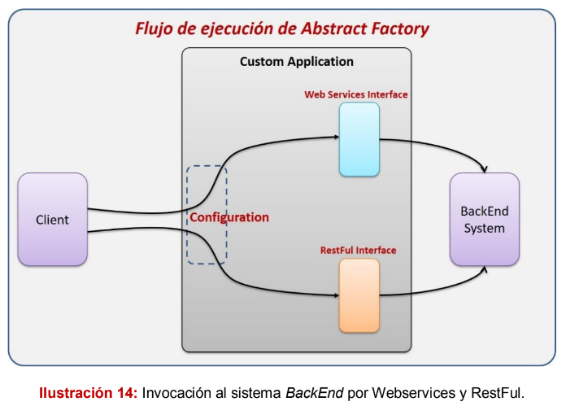
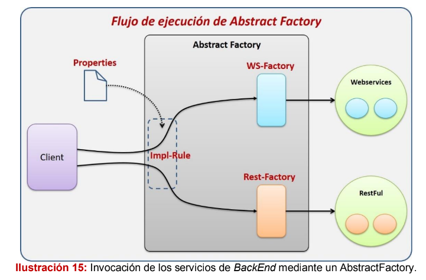

# Patrón Abstract Factory
El patrón de diseño Abstract Factory busca agrupar un conjunto de clases que
tiene un funcionamiento en común, llamadas familias, las cuales son creadas
mediante un Factory. Este patrón es especialmente útil cuando requerimos tener
ciertas familias de clases para resolver un problema, sin embargo, puede que se
requieran crear implementaciones paralelas de estas clases para resolver el
mismo problema pero con una implementación distinta.

la diferencia entre entre Factory Method es que Abstract Factory se enfoca en
la creación de familias completas de objetos y el Factory Method se enfoca en la
creación individual de objetos.

# Cuándo utilizarlo:

- Cuando la creación directa de un objeto por medio del operador new
puede ser perjudicial.

- Cuando no se conoce en tiempo de diseño, la familia de clases que se
utilizará en ejecución.

- Cuando es necesario controlar la creación de objetos por medio de una
interface común.

- Cuando es necesario trabajar con distintas plataformas, manteniendo la
misma estructura y compatibilidad con todas ellas.

# Escenario
Existen ocasiones donde nuestra aplicación necesita soporte para conectarse al
BackEnd mediante dos estrategias. Esto es utilizado cuando queremos darle la
oportunidad a nuestros clientes que eligen qué tipo de conexión les parece mejor;
por ejemplo, podemos crear una aplicación que se comunique al sistema BackEnd
mediante servicios SOA o RestFul, no obstante, será el cliente quien tome esta
decisión, por lo que nuestro sistema debe estar preparado para soportar esta
Arquitectura.

# Solución

Haremos uso del patrón de diseño Abstract
Factory. Como ya vimos, este patrón nos permite crear familias de clases que
cumplan la misma funcionalidad pero con implementación diferente. Por lo cual,
crearemos una interface para cada servicio que nos proporcione el sistema
BackEnd, estas interfaces representarán de forma abstracta los servicios que
tendremos disponibles.

Tendremos que crear una implementación para WebService y RestFul con el objetivo de tener
la funcionalidad implementada para cada familia.

