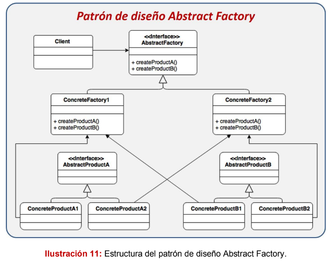
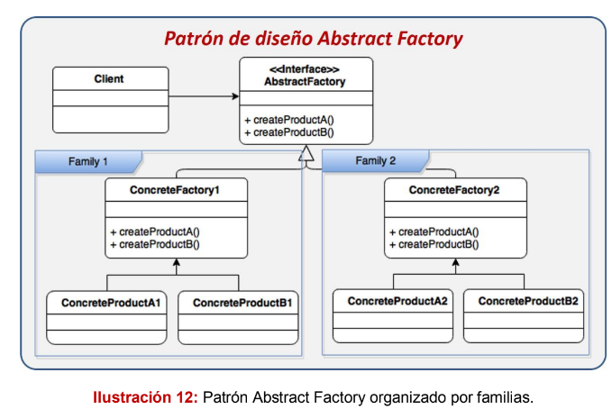
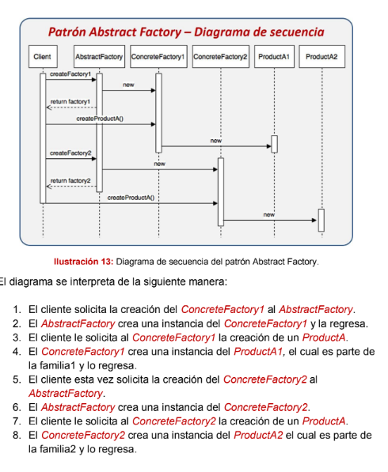

# Patrón Abstract Factory
El patrón de diseño Abstract Factory busca agrupar un conjunto de clases que
tiene un funcionamiento en común, llamadas familias, las cuales son creadas
mediante un Factory. Este patrón es especialmente útil cuando requerimos tener
ciertas familias de clases para resolver un problema, sin embargo, puede que se
requieran crear implementaciones paralelas de estas clases para resolver el
mismo problema pero con una implementación distinta.

la diferencia entre entre Factory Method es que Abstract Factory se enfoca en
la creación de familias completas de objetos y el Factory Method se enfoca en la
creación individual de objetos.

